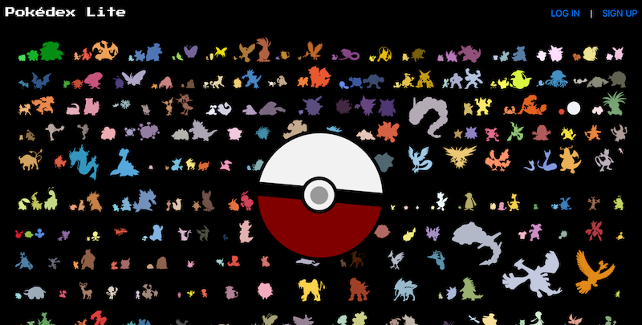
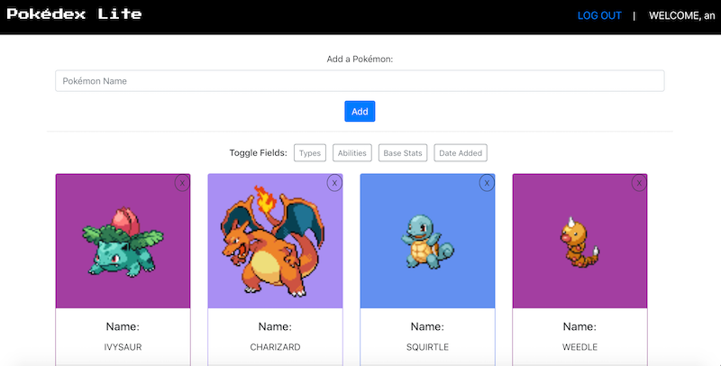

# React Pokédex Lite
Project 4 (MERN-stack Application)

## Introduction

This app was developed to partly mimic the functionality of a Pokédex, where a user can add to a list of Pokémon that he/she has seen and read more about a Pokémon's details. The Pokémon information is retrieved from the [PokéAPI](https://pokeapi.co). 

Landing Page: 

Pokédex Page: 

## Getting Started

- Trello Board: [Project 4](https://trello.com/b/hnv5V7IQ/project-4-pokédex)
- Heroku Deployed App: [React Pokédex Lite](https://react-pokedex-lite.herokuapp.com)

## Technologies Used

- HTML5
- CSS3 with Bootstrap v4.3
- JavaScript
- React with client-side routing
- Node.js
- Express.js
- MongoDB Atlas
- Mongoose ODM
- JWT (Token-based Authentication and Authorization)
- PokéAPI v2

## Future Enhancements

- Add functionality to see a modal with a Pokémon's evolution chain
- Add encounter location and flavor text information

## Credits

This project was bootstrapped with [Create React App](https://github.com/facebook/create-react-app).
